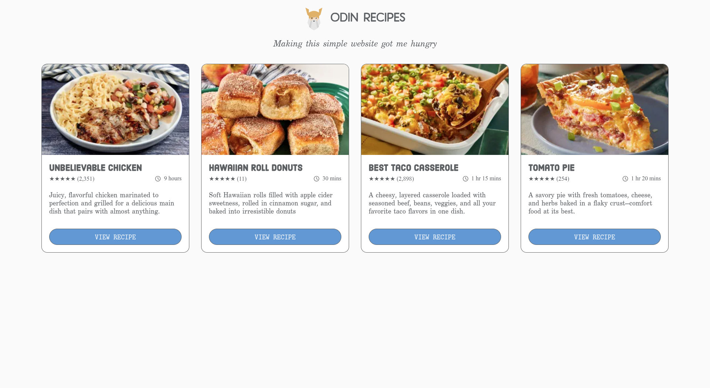
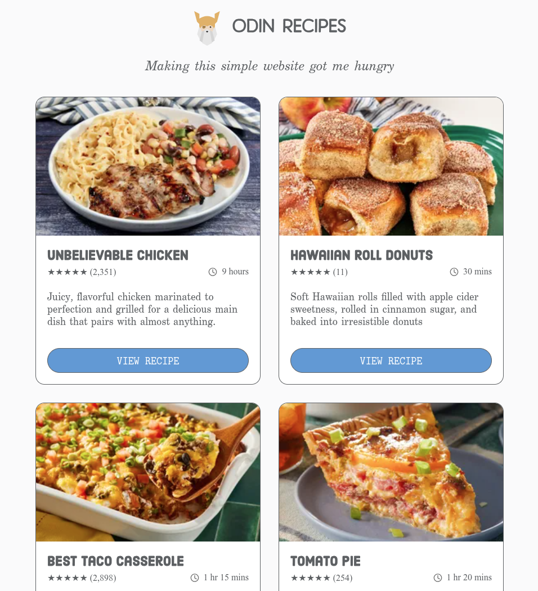
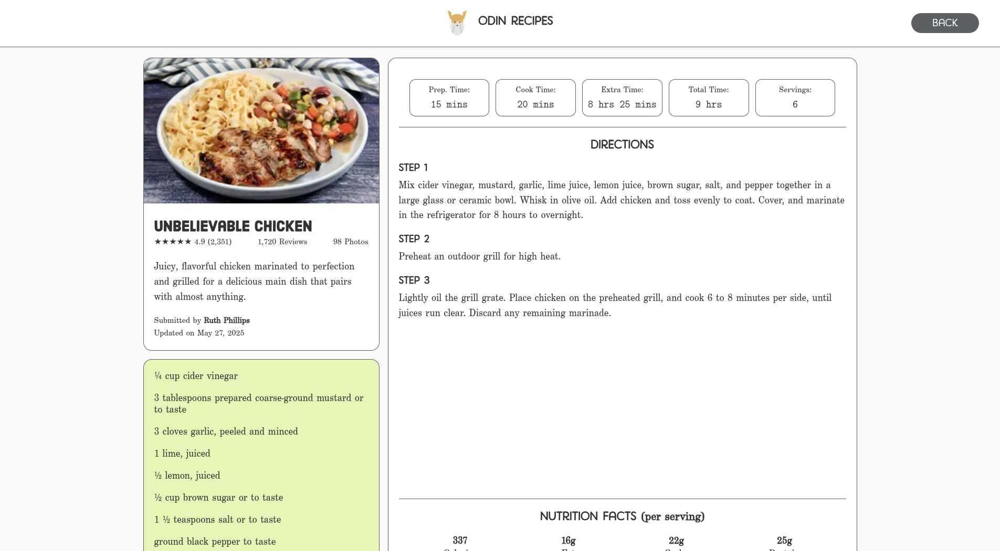
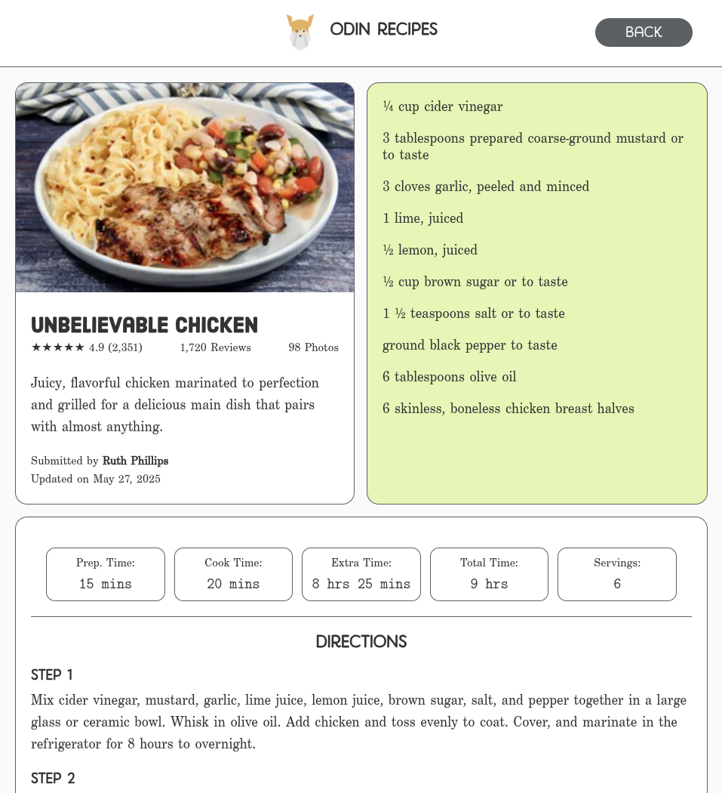
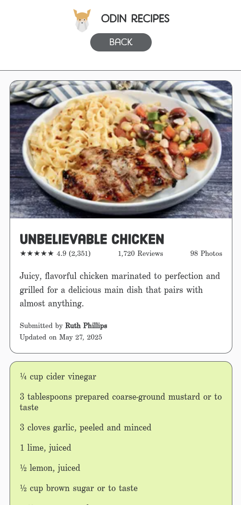

# Recipe Website

A simple recipe website created as part of [The Odin Project](https://www.theodinproject.com/) curriculum.  
This project is focused on practicing **HTML semantics**, **CSS styling**, and the basics of building a multi-page site.

---

## Features
- Clean and responsive layout using **grid** and **flexbox**
- Recipe cards with images, descriptions, and links
- Hover effects for interactive elements

---

## Background
This project is part of my journey through The Odin Project foundations.  
I am **not a native English speaker**, so please excuse any grammar mistakes in the text or descriptions. My main focus here is learning and improving my **web development skills**, as well as building confidence in writing code and documentation.

---

## Technologies Used
- HTML5
- CSS3

---

## Preview

---

## Future Improvements
- Add more recipes with structured data
- Improve responsiveness for mobile devices
- Apply more semantic HTML tags
- Add interactivity with JavaScript (e.g., favorite button, search, filters)

---
